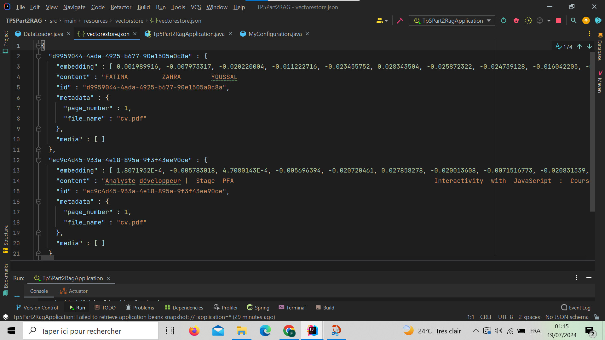
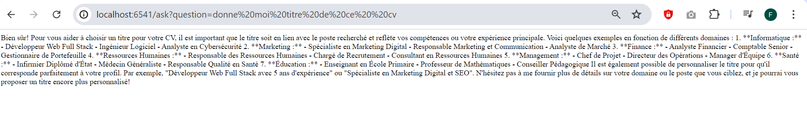
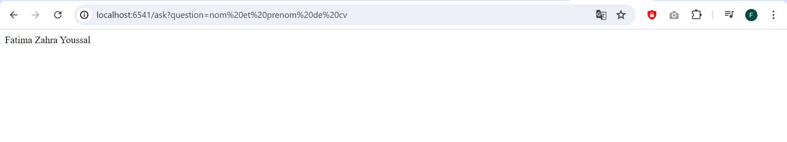
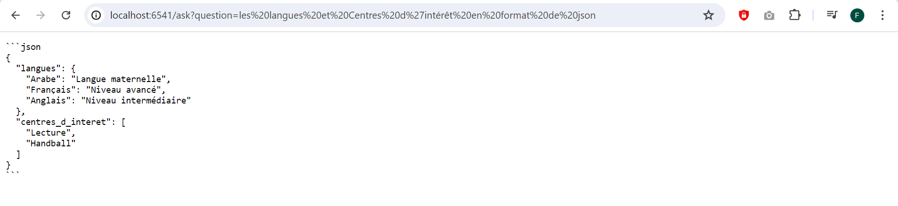
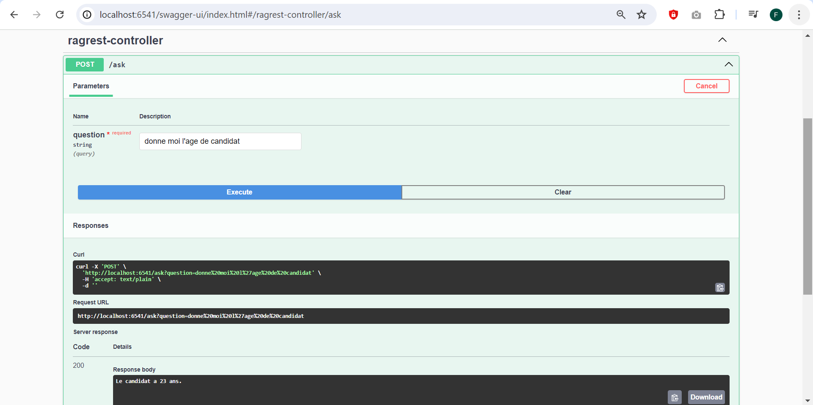
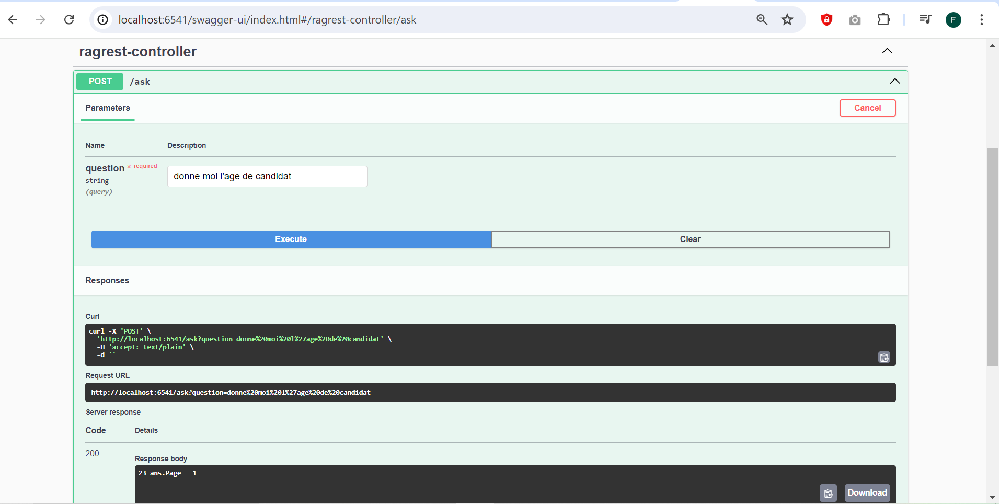

<h1>RAG</h1>
<h3>VectoreStore</h3>

<h3>Cette capture d'écran montre le résultat d'une requête HTTP GET effectuée sur une application Spring Boot
</h3>
<h3>Cette capture d'écran montre le résultat d'une requête HTTP GET effectuée sur une application Spring Boot</h3>

<h3>La page web affiche une réponse au format JSON contenant les compétences linguistiques et les centres d'intérêt. </h3>

<h3>Swagger</h3>

